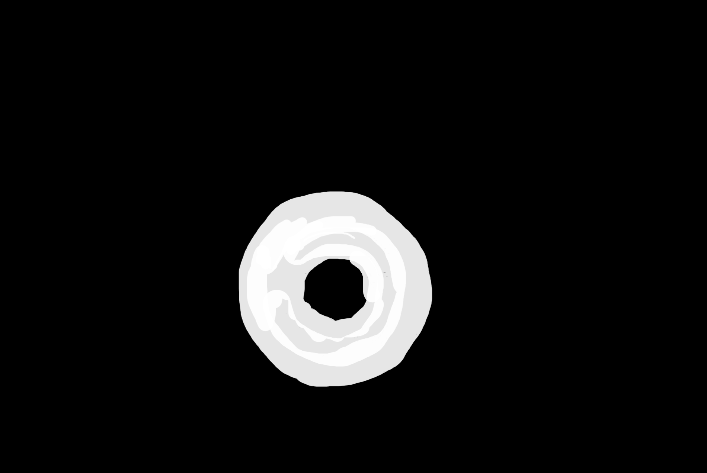
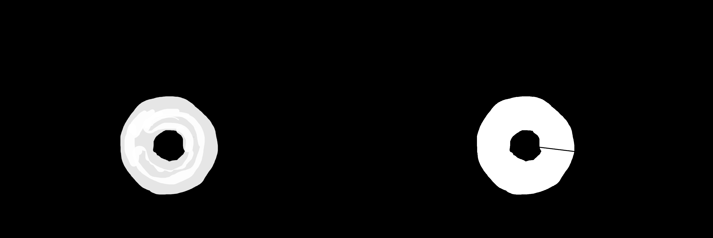

# ComfyUI Hollow Preserve

A ComfyUI custom node that breaks closed loops in masks to prevent inpainting models from modifying regions that are fully enclosed by mask strokes.

## Purpose

When using masks for inpainting in ComfyUI, areas that are completely enclosed by mask strokes (like the center of a donut shape) are often unintentionally modified by inpainting models, even if they're not directly painted as part of the mask.

This node adds a strategic break in the closed mask contour (a line from the center to the edge), which prevents the inpainting model from treating the enclosed area as part of the mask. This allows you to preserve specific regions inside your masked areas.

## Features

- Automatically detects closed loops in masks that contain non-masked areas
- Creates clean break lines from the center of the enclosed area to the edge
- Only modifies masks that actually have enclosed areas (non-destructive to other masks)
- Customizable break line thickness

## Installation

1. Navigate to your ComfyUI custom nodes directory
   ```
   cd ComfyUI/custom_nodes/
   ```

2. Clone this repository:
   ```
   git clone https://github.com/krmahil/comfyui-hollow-preserve.git
   ```

   Or download and extract the zip file to your ComfyUI custom nodes directory.

3. Install the required dependencies:
   ```
   pip install -e comfyui-hollow-preserve
   ```

4. Restart ComfyUI

## Usage

1. In ComfyUI, locate the "Break Closed Mask Loops" node in the mask category
2. Connect a mask (usually from a MaskEditor node) to the input
3. Adjust the break_thickness parameter if needed (default: 3)
4. Connect the output mask to your inpainting node

## Example Workflow

```
MaskEditor → Break Closed Mask Loops → InpaintModel
```

## How It Works

1. Identifies closed contours in the mask that contain non-masked areas
2. Calculates the center point of each contour
3. Draws a line from the center to the edge of the contour
4. This break prevents the inpainting model from treating the enclosed area as part of the mask

## Examples

### Donut-shaped Mask
| Original Mask | With Break Line | Result in Inpainting |
|---------------|----------------|---------------------|
|  |  |  |

*Left: Original donut-shaped mask where the center would be unintentionally modified.  
Middle: Mask with a break line added.  
Right: Inpainting result where only the masked area is modified, not the center.*

## Testing

This repository includes a test script to visualize the effect on your masks:

```
python test_mask.py your_mask.png [break_thickness]
```

The script will generate:
- A processed version of your mask with break lines
- A side-by-side comparison of original and processed masks

## Requirements

- ComfyUI
- Python 3.6+
- OpenCV
- NumPy
- Pillow (PIL)

## License

MIT 